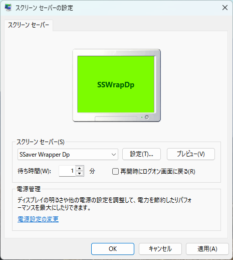

<!-- -*- encoding: utf-8 -*- -->

SSWrapDp
========

フルスクリーン表示をする外部プログラムをWindows用スクリーンセーバーとして呼び出すためのラッパー。Delphi 12で作成。

Description / 説明
------------------

以下の条件を満たすプログラム(.exe)やスクリプト(.pyw等)を、Windows用スクリーンセーバ相当として利用できる。

* 多重起動禁止処理が入っていて、
* フルスクリーン表示をして、
* キーボードやマウスに反応して終了すること。

Screenshots / スクリーンショット
--------------------------------

Requirement / 依存関係
----------------------

* 64bit版 Windows。32bit版には未対応。

Environment / 動作確認環境
--------------------------

* Windows11 x64 25H2
* Delphi 12 Community Edition

Install / インストール方法
--------------------------

Releasesページからzipを入手して解凍すると SSWrapDp.scr が入っているので以下のフォルダにコピーする。

* 64bit版Windowsの場合、C:/Windows/System32/ 以下にコピー。

32bit版Windowsには未対応。

Uninstall / アンインストール方法
--------------------------------

* C:/Windows/System32/SSWrapDp.scr を削除。
* 設定ファイル %AppData%/SSWrapDp/SSWrapDp.json も削除してしまってよい。

Usage / 使い方
--------------

1. 「スクリーンセーバーの変更」を表示。
2. リストから「SSaver Wrapper Dp」を選ぶ。
3. 「設定」ボタンをクリックすると呼び出したいプログラムを設定できるダイアログが表示される。
4. 各テキストボックスに、管理名と、呼び出したい外部プログラムのファイルパスを入力する。引数があればそれも入力する。
   *  プレビュー画面用のbmp画像 (152 x 112) は指定してもしなくても構わない。指定すればプレビュー画面にそのbmp画像が表示されるようになる。

設定ダイアログの下部に並んだボタンの動作は以下。

* Add : リストに追加登録。
* Delete : リスト上で選択中の項目を削除。
* Update : リスト上で選択中の項目をテキストボックスの内容で更新。
* Save : リスト上で選択した項目が呼び出されるよう、設定が保存される。
* Close : 設定ダイアログを閉じる。「Save」が押されない限り、設定の保存はしない。

### 入力例

#### C#等で作ったフルスクリーン表示プログラムの場合

* Name : C# Sample
* File Path : C:\\hoge\\fuga\\csharp_sample.exe
* Arguments : 空

#### pygame や tkinter を利用したPythonスクリプトの場合

* Name : pygame sample
* File Path : pyw.exe
* Aruguments : C:\\hoge\\fuga\\pygame_sample.pyw

License / ライセンス
--------------------

CC0 / Public Domain

Author / 作者名
---------------

[mieki256](https://github.com/mieki256)

